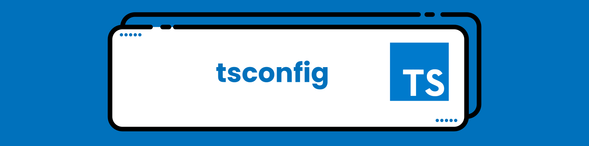

# Estudando TypeScript 

  

Repositório feito para armazenar os estudos em TypeScript

## 🚀 Recursos Utilizados

- **[TypeScript](https://www.typescriptlang.org/download)**
- **[Visual Studio Code](https://code.visualstudio.com/?WT.mc_id=javascript-14034-gllemos)**
- **[Node.js](https://nodejs.org/en/)**
- **[Extensão Visual Studio Code - Code Runner](https://marketplace.visualstudio.com/items?itemName=formulahendry.code-runner&WT.mc_id=javascript-14034-gllemos)**

## ✏️ Assuntos estudados

<b>Introdução à TypeScript</b>

-  O que é TypeScript?
- Conhecendo o Playground do TypeScript
- Preparando o Ambiente de Desenvolvimento

<b>Tipos Básicos</b>

- Type Annotation
- Boolean
- Number
- String
- Array
- Tuple
- Enum
- Any
- Object
  

<b>Interfaces</b>

  - Introdução à Interfaces
  - Optional Properties
  - Propriedades Readonly
  - Function Types
  - Extensão de Interfaces
  - Uso do Omit em Interfaces

<b>Generics</b>

- Introdução a Generics em TypeScript

